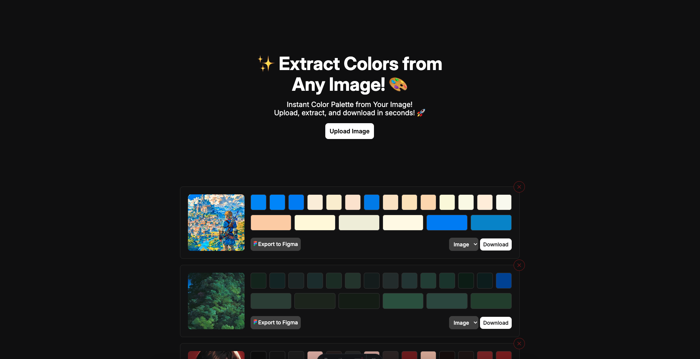

# Color Rush ✨ Extract Colors from Any Image! 🎨

Color Rush is a powerful tool that allows you to extract colors from any image in just a few clicks! Whether you're working on a design project, creating a color palette, or just want to explore the vibrant hues of your favorite image, Color Rush makes it easy.



## Features

- **Upload any image**: Simply upload an image, and Color Rush will automatically detect its colors.
- **Extract colors**: Get a full palette of colors extracted from the image.
- **Export to Figma**: Export the extracted color palette directly to Figma for easy use in your design projects.
- **Download with colors**: Download the image with the extracted colors highlighted.
- **Export as PDF**: Get a downloadable PDF with the extracted colors.

## How to Use

1. **Upload your image**: Click the "Upload Image" button to select an image from your computer.
2. **Extract colors**: Once the image is uploaded, Color Rush will analyze it and display the extracted colors.
3. **Export options**:
   - **Export to Figma**: Click the "Export to Figma" button to send your color palette directly to Figma.
   - **Download with colors**: Download the image with its colors highlighted by clicking the "Download Image" button.
   - **Export as PDF**: Click the "Export as PDF" button to get a PDF file with your color palette.

## Installation

```bash
git clone https://github.com/ivanglpz/Colorush.git
```

install dependencies

```bash
pnpm install
```

run server development

```bash
pnpm dev
```

## Contributing

If you'd like to contribute to the development of Color Rush, feel free to fork the repository and submit a pull request with your changes. We'd love to hear from you!

## License

This project is licensed
